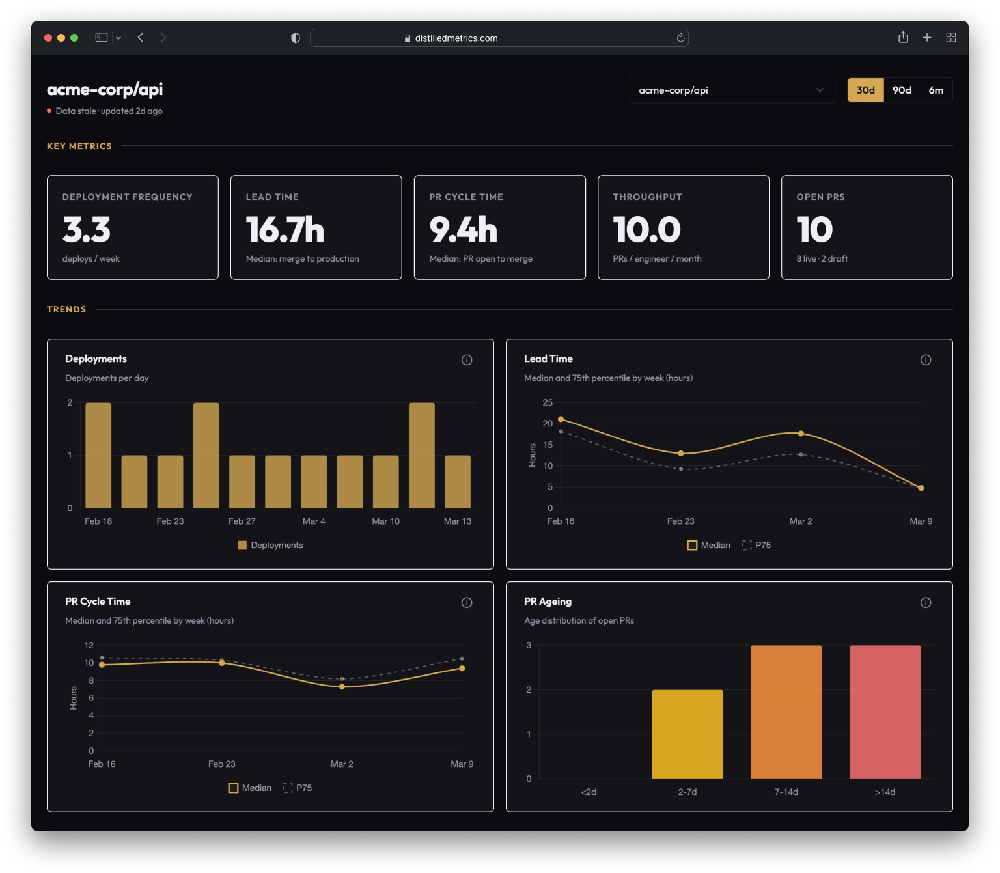

# Distilled

Distilled is a self-serve engineering intelligence tool for leaders who want clarity, not clutter. Connect GitHub and it turns your pull requests and deployments into a small set of delivery metrics you can trust — how often you ship, how long change takes to reach production, and where work is quietly getting stuck. Every number is grounded in real PRs and deployments, not manual reporting.



## Prerequisites

- Python 3.12+ with [Poetry](https://python-poetry.org/)
- Node 20+ via [nvm](https://github.com/nvm-sh/nvm) (`.nvmrc` in `client/`)
- [Docker](https://docs.docker.com/get-docker/) (for Postgres)
- Make

## Quick start

```sh
# install dependencies
cd server && poetry install && cd ..
cd client && nvm use && npm install && cd ..

# configure
cd server && cp .env.example .env && cd ..

# database
make db-up
make migrate

# run both server and client
make dev
```

- Client: http://localhost:5173
- Server: http://localhost:8000
- API docs: http://localhost:8000/docs
- DB browser: http://localhost:5050

For full setup including the GitHub App integration, see the [local setup runbook](docs/runbooks/local-setup.md).

## Structure

```
server/   # FastAPI + Poetry
client/   # React + Vite + TypeScript + Tailwind
e2e/      # Playwright browser smoke tests
docs/     # Architecture, RFCs, ADRs, runbooks
Makefile  # dev commands + database management
```

## Makefile targets

| Target             | Description                                                |
| ------------------ | ---------------------------------------------------------- |
| `dev`              | Run server + client concurrently                           |
| `dev-server`       | Server only (port 8000)                                    |
| `dev-client`       | Client only (port 5173)                                    |
| `db-up`            | Start Postgres + pgweb (DB browser at port 5050)           |
| `db-down`          | Stop Postgres + pgweb                                      |
| `db-reset`         | Drop volume + restart                                      |
| `migrate`          | Run Alembic migrations                                     |
| `create-migration` | Create new migration (`MSG="description"`)                 |
| `test`             | Run all server + client tests                              |
| `test-server`      | Server tests only                                          |
| `test-client`      | Client tests only                                          |
| `test-coverage`    | Server + client tests with coverage                        |
| `lint`             | Lint server (ruff + mypy) + client (eslint + prettier)     |
| `lint-server`      | Server lint only                                           |
| `lint-client`      | Client lint only                                           |
| `format`           | Auto-format server (ruff) + client (prettier)              |
| `format-server`    | Server format only                                         |
| `format-client`    | Client format only                                         |
| `seed-demo`        | Seed the database with realistic demo data                 |
| `seed-reset`       | Remove all demo data from the database                     |
| `seed-claim`       | Link your Clerk user to seed data (`USER=<clerk_user_id>`) |
| `smoke-install`    | Install Playwright and download Chromium (first-time)      |
| `smoke-test`       | Run browser smoke tests against the running app            |
| `website-build`    | Build the marketing website                                |
| `website-serve`    | Serve the website locally with live reload                 |
| `website-test`     | Test the website's URL contract (needs `caddy`)            |

`make help` prints the same list.

## Documentation

Everything lives in `/docs`; key starting points:

- [Architecture](docs/architecture.md)
- [Metrics](docs/metrics.md)
- [Analytics](docs/analytics.md)
- [Local Setup Runbook](docs/runbooks/local-setup.md)
